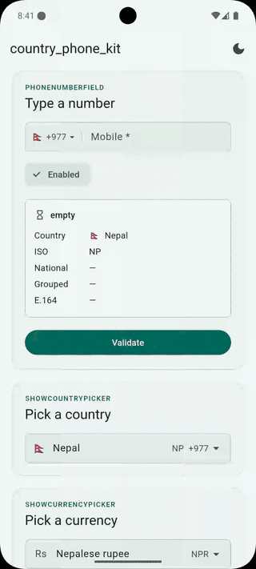

# Country Phone Kit

[](https://pub.dev/packages/country_phone_kit)


Countries, flags, dial codes, currencies and per-country phone validation
and formatting as plain Dart data, plus an optional phone field, country
picker and currency picker.

<p align="center">
  
</p>


| You need | Here it is |
| --- | --- |
| The country list - names, flags, ISO codes | `Countries.all` |
| Dial codes, both directions | `country.dialCode`, `Countries.byDialCode('977')` |
| Validation *per country* | `PhoneNumber.isValidNumber(input, isoCode: 'NP')` |
| Formatting - as you type, and for the wire | `PhoneNumberInputFormatter`, `number.e164` |
| Currencies - code, name, symbol, per country | `Currencies.all`, `country.currency` |

```dart
import 'package:country_phone_kit/country_phone_kit.dart';

Countries.all;                                          // 243 countries
Countries.byIsoCode('NP')!.flag;                        // 🇳🇵
Countries.byIsoCode('NP')!.dialCodePrefix;              // +977
PhoneNumber.isValidNumber('9812345678', isoCode: 'NP'); // true
PhoneNumber.formatE164('(981) 234-5678', isoCode: 'NP');// +9779812345678
Currencies.all;                                         // 153 currencies
Currencies.forCountry('NP');                            // NPR · Nepalese rupee · Rs
```

## Install

```yaml
dependencies:
  country_phone_kit: ^1.0.0
```

```dart
import 'package:country_phone_kit/country_phone_kit.dart';
```

## 1. The country list

`Countries.all` holds 243 countries sorted by name.

```dart
for (final country in Countries.all) {
  print('${country.flag} ${country.name} (${country.isoCode}) ${country.dialCodePrefix}');
  // 🇳🇵 Nepal (NP) +977
}
```

Each `Country` carries:

| Field | Example | Notes |
| --- | --- | --- |
| `name` | `Nepal` | English, and the list's sort order |
| `isoCode` | `NP` | ISO-3166-1 alpha-2 - the identity; equality is by this |
| `iso3Code` | `NPL` | alpha-3; null for a few territories that have none |
| `dialCode` | `977` | **without** the `+` |
| `dialCodePrefix` | `+977` | with the `+`, for display |
| `flag` | `🇳🇵` | regional-indicator emoji - scales, themes, costs nothing to bundle |
| `minLength` / `maxLength` | `10` / `10` | national-number digits; for sizing a field, *not* for validating |
| `currency` | `NPR · Nepalese rupee · Rs` | ISO-4217 code, name, symbol |

### Lookups

```dart
Countries.byIsoCode('np');            // Country? - case-insensitive, null-tolerant
Countries.byDialCode('977');          // List<Country> - every country on +977
Countries.byDialCode('1');            // US, Canada, Dominican Republic
Countries.primaryForDialCode('1');    // United States - when you need exactly one
Countries.longestDialCodePrefix('9779812345678');  // '977', never '97'
Countries.search('nep');              // ranked for a picker: exact → starts-with → contains
```

## 2. A phone number

```dart
final nepal = Countries.byIsoCode('NP')!;
final number = PhoneNumber.parse('+977 098-1234-5678', fallbackCountry: nepal);

number.country.isoCode;     // 'NP'
number.nationalNumber;      // '9812345678'  - separators and trunk 0 gone
number.dialCode;            // '977'
number.e164;                // '+9779812345678'   ← what you send
number.isValid;             // true
number.error;               // null, or empty / tooShort / tooLong / invalid
number.formatNational;      // '981-2345678'
number.formatInternational; // '+977 981-2345678' ← what you show
```

## 3. Validation, per country

Two forms. The one-liner, when you just need a yes or no:

```dart
PhoneNumber.isValidNumber('9812345678', isoCode: 'NP');   // true
PhoneNumber.isValidNumber('+977 981 234 5678');           // true - code says the country
PhoneNumber.formatE164('981 234 5678', isoCode: 'NP');    // '+9779812345678', or null if invalid
```

Or the model, when you want to tell the user *what* is wrong:

```dart
switch (number.error) {
  case PhoneNumberError.empty:    return 'Enter a phone number';
  case PhoneNumberError.tooShort: return 'That number is too short';
  case PhoneNumberError.tooLong:  return 'That number is too long';
  case PhoneNumberError.invalid:  return 'Not a valid number for ${number.country.name}';
  case null:                      return null;
}
```

It checks real number patterns, not just length:

```dart
PhoneNumber.isValidNumber('1112223333', isoCode: 'NP');  // false
```

## 4. Formatting as the user types

`PhoneNumberInputFormatter` works on any `TextField`:

```dart
TextField(
  keyboardType: TextInputType.phone,
  inputFormatters: [PhoneNumberInputFormatter('NP')],
)
```

```dart
PhoneNumberInputFormatter.formatDigits('2025550100', 'US');  // '(202) 555-0100'
```

## 5. Currencies

Every ISO-4217 currency used by a country, listed once.

```dart
Currencies.all;                       // 153 currencies, sorted by code
Currencies.byCode('npr');             // CountryCurrency? - case-insensitive
Currencies.forCountry('NP');          // what Nepal spends
Currencies.countriesUsing('EUR');     // every country using the euro
Currencies.search('rupee');           // ranked for a picker: INR, LKR, MUR, NPR, …
```

Or from a country:

```dart
final currency = Countries.byIsoCode('DE')!.currency!;
'${currency.symbol} ${currency.code}';  // '€ EUR'
```

## Widgets

### PhoneNumberField

```dart
PhoneNumberField(
  value: _phone,
  label: 'Phone number',
  hintText: 'Enter your number',
  errorText: _errorFor(_phone),
  onChanged: (number) => setState(() => _phone = number),
)
```

Also takes `enabled`, `required`, `autofocus`, `focusNode`, `textInputAction`,
`onSubmitted`, `pickerLabels`, `useRootNavigator` and a full `decoration`
override.

### The country picker

```dart
final picked = await showCountryPicker(context: context, selected: current);
```

### The currency picker

```dart
final picked = await showCurrencyPicker(
  context: context,
  selected: Currencies.byCode('NPR'),
);
```

### The inline currency dropdown

A searchable dropdown instead of a bottom sheet:

```dart
CurrencyDropdownField(
  value: _currency,
  label: 'Currency',
  onChanged: (currency) => setState(() => _currency = currency),
)
```

For your own lists, use `SearchableDropdownField<T>`.

### Styling

All widgets follow your app's `ThemeData`. To customise the field:

```dart
PhoneNumberField(
  value: _phone,
  onChanged: _onChanged,
  decoration: InputDecoration(border: OutlineInputBorder(), filled: true),
)
```

### Localisation

Pass your own strings:

```dart
PhoneNumberField(
  // ...
  pickerLabels: CountryPickerLabels(
    title: context.l10n.selectCountry,
    searchHint: context.l10n.searchCountryOrCode,
    clearSearchTooltip: context.l10n.clearSearch,
    emptyTitle: context.l10n.noMatch,
    emptyMessage: context.l10n.noCountryMatches,
  ),
)
```

`CurrencyPickerLabels` does the same for the currency picker.

## Example app

```sh
cd example
flutter pub get
flutter run
```
